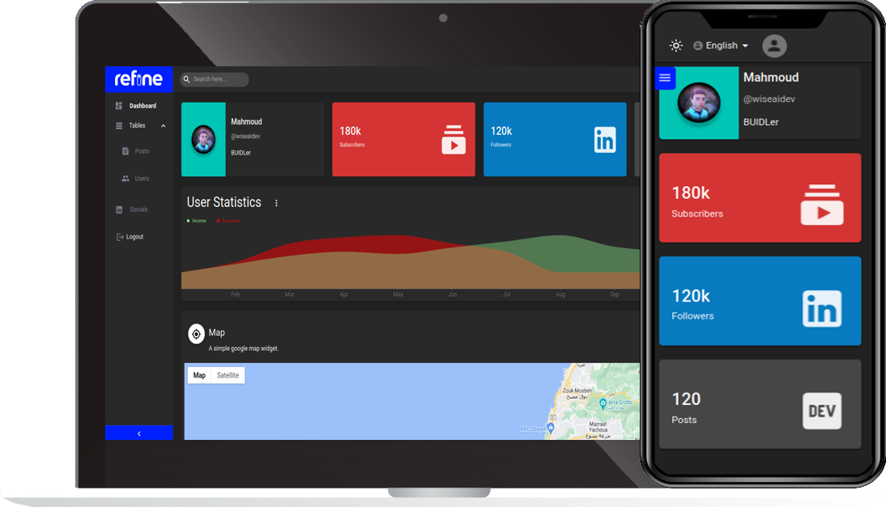

# Fine Dashboard

<div align="center">

[](https://fine-dashboard.netlify.app/register)
[](https://fine-dashboard.vercel.app/)
[](https://app.netlify.com/sites/thriving-gaufre-13a5a8/deploys)
[](https://github.com/wiseaidev/fine-dashboard/releases/tag/v0.1.0)

</div>

<div align="center" style="margin: 30px;">
    
</div>
<br/>

This [refine](https://github.com/pankod/refine) project was generated with [superplate](https://github.com/pankod/refine).

## 🔗 Project Demo links

- [Netlify](https://fine-dashboard.netlify.app/).
- [Vercel](https://fine-dashboard.vercel.app/).

## 📙 About

### 👌 Supported Features

- Supabase as a backend.
- A Google Map Widget.
- 2 charts built using rechartjs.
- Login and registration using user/password, Google, and Github(Github is working on localhost. Google is not working at the moment).
- Data provided by fake data endpoint hosted on refine(https://api.fake-rest.refine.dev).
- A custom social widget that act as a simple Linkedin clone.
- Redux Toolkit's `createAsyncThunk` and `RTKQ`.

### 📙 Description

Fine Dashboard is a pretty advanced dashboard equipped with cool analytics and charts. It is user-friendly, with a clean interface that is easy to navigate. In addition, It is fully responsive meaning that it will work seamlessly on various devices. So whether you're accessing it on a laptop, or mobile, it will look great everywhere.

### 🏃 Participants

- Solo.

### 🔥 Preview

- Video.

## 🚧 Set up Project

## 🛠️ Prerequisites

- A Supabase Account.
- Google Cloud API keys, Cliend ID and secrets.

## 👶 Getting Started

### ⚡️ Confinure New Supabase Account.

- [Register a new Supabase Account](https://app.supabase.com/sign-in).

- Set the following environment variables to your supabase app URL and ANON KEY:

```sh
REACT_APP_SUPABASE_URL=
REACT_APP_SUPABASE_ANON_KEY=
```

### 🗺️ Goolge API key credentials.

- Go to your [Google Cloud console](https://console.cloud.google.com/apis/credentials), then go to `Menu` > `APIs & Services` > `Credentials`.

- Click `Create credentials` > `API key`.

- Click `Copy` to copy your API key for use in our project.

- Set the following environment variable to your API key:

```sh
export REACT_APP_GOOGLE_KEY=
```

### 🧢 Adding Google Credentials in Supabase

- Go to your [Google Cloud console](https://console.cloud.google.com/apis/credentials), then go to `Menu` > `APIs & Services` > `Credentials`.

- Click `Create credentials` > `Create OAuth client ID`.

- Click `Copy` to copy your Cliend key and secret for use in our project.

- Go to your Supabase dashboard an enable Google auth provider.

- Paste the recently copied values into their correspondent places.

### 👾 Adding Github Credentials in Supabase

- Go to [your Github developers page](https://github.com/settings/developers), then click `Register a new application`.

- Click `Generate a new client secret`.

- Click `Copy` to copy your Cliend ID and key for use in our project.

- Go to your Supabase dashboard an enable Github auth provider.

- Paste the recently generated values into their correspondent places.

## 🔨 Install Project

### 🔁 Running the development server.

- Fork/Clone the repo:

```sh
git clone git@github.com:wiseaidev/fine-dashboard.git
```

- Open the newly created directory:

```sh
cd fine-dashboard
npm install
```

In order to run the project locally or build for production use, you will need to set the following environment variables to connect with the Supabase backend and google maps:

```sh
REACT_APP_SUPABASE_URL=
REACT_APP_SUPABASE_ANON_KEY=
REACT_APP_GOOGLE_KEY=
```

Now you can run the client:

```sh
npm run dev
```

Navigate to [http://localhost:3000](http://localhost:3000) to explore the login page.

### ⚙️ Building for production.

```sh
npm run build
```

### 🔁 Running the production server.

```sh
npm run start
```

## 🚀 Deployment

To deploy the client, you will need to set the following environment variables.

```sh
REACT_APP_SUPABASE_URL=
REACT_APP_SUPABASE_ANON_KEY=
REACT_APP_GOOGLE_KEY=
```

### 🏗️ Deploy to a Static Hosting Provider

[](https://heroku.com/deploy?template=https://github.com/wiseaidev/fine-dashboard)

[](https://app.netlify.com/start/deploy?repository=https://github.com/wiseaidev/fine-dashboard)

## 🚧 2023 Roadmap

- Fix Google authentication.
- Add crud operations for socials widgets.
- Add support for i18n for the remaining widgets.

## 📚 Learn More

To learn more about **refine**, please check out the [Documentation](https://refine.dev/docs)

- **REST Data Provider** [Docs](https://refine.dev/docs/core/providers/data-provider/#overview)
- **Material UI** [Docs](https://refine.dev/docs/ui-frameworks/mui/tutorial/)
- **Inferencer** [Docs](https://refine.dev/docs/packages/documentation/inferencer)
- **Material UI Light/Dark Mode** [Docs](https://refine.dev/docs/ui-frameworks/mui/customization/mui-custom-theme/)
- **Material UI Custom Theme** [Docs](https://refine.dev/docs/ui-frameworks/mui/customization/mui-custom-theme/)
- **Custom Layout** [Docs](https://refine.dev/docs/ui-frameworks/mui/customization/mui-custom-layout/)
- **React Router** [Docs](https://refine.dev/docs/core/providers/router-provider/)
- **Custom Auth Provider** [Docs](https://refine.dev/docs/core/providers/auth-provider/)
- **i18n** [Docs](https://refine.dev/docs/core/providers/i18n-provider/)

## 📝 License

This project and the accompanying materials are made available under the terms and conditions of the [`MIT LICENSE`](https://github.com/wiseaidev/fine-dashboard/blob/main/LICENSE).
